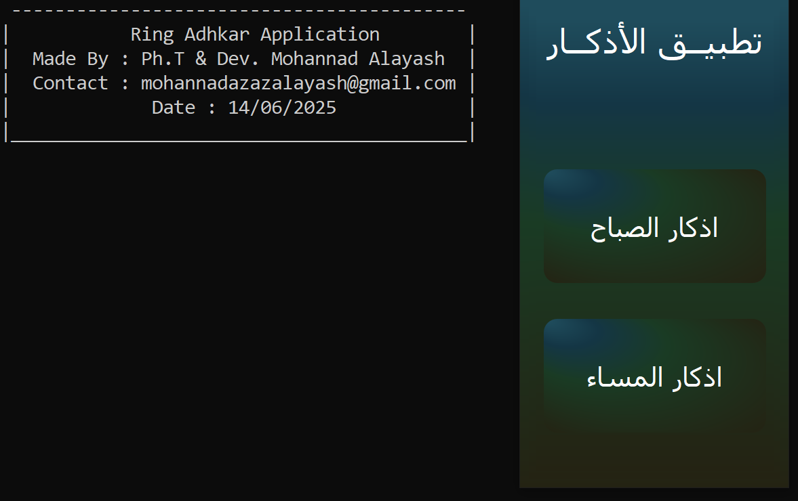
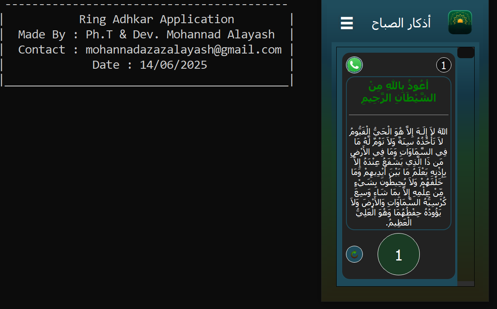
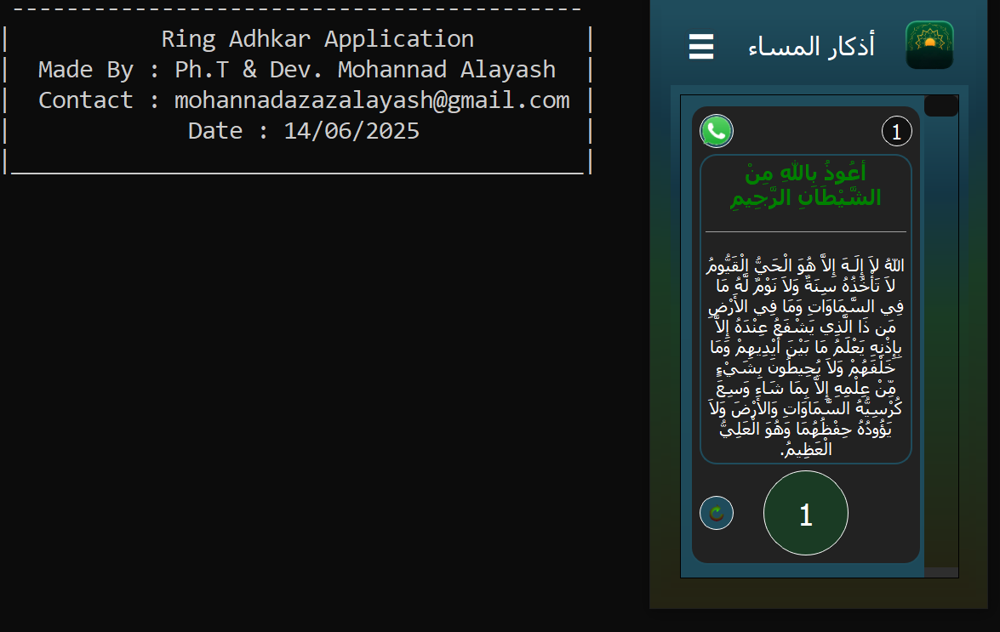
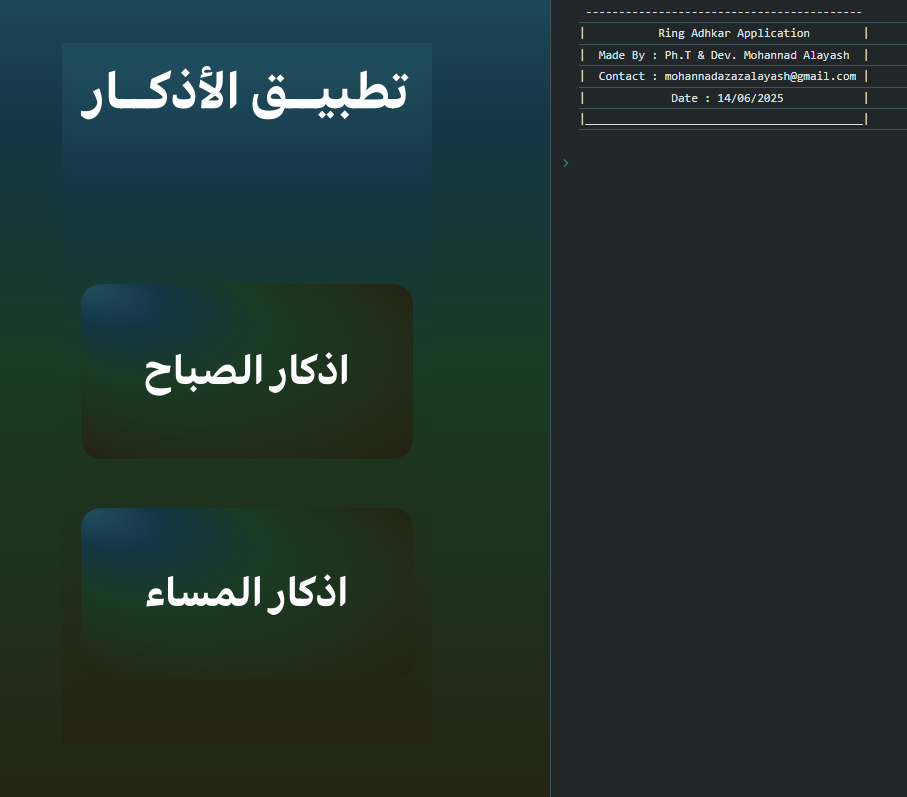
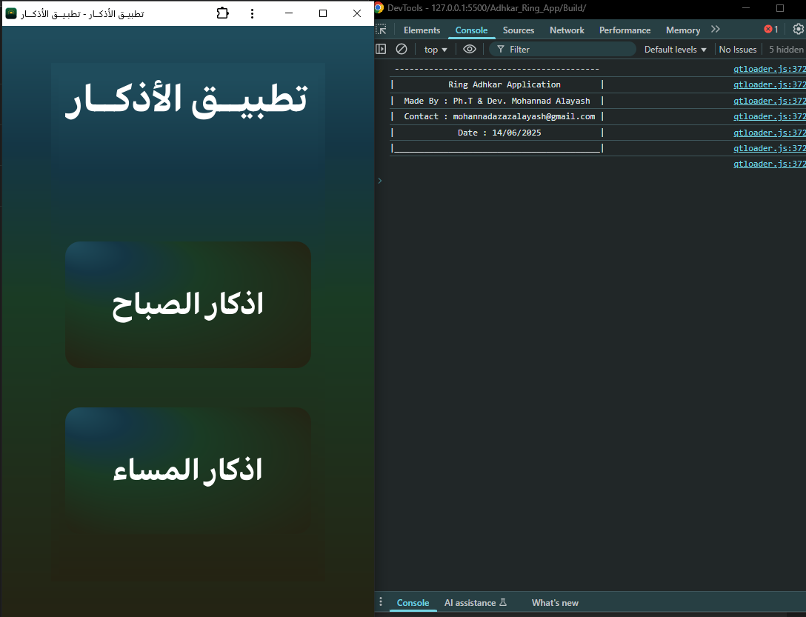
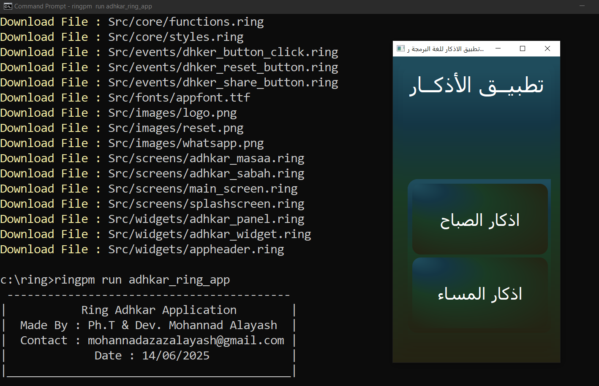

# 🌟 **تطبيق الأذكار - Adhkar App**  
**تم بناؤه بحب ❤️ باستخدام [لغة رينج](https://ring-lang.github.io/)  و WebAssembly**  

   

---

## 📌 وصف المشروع  
الحمدلله الذي بنعمته تتم الصالحات،  
اكملت برمجة تطبيق جديد وهو:  

**تطبيق الأذكار**  
- 🌐 تطبيق يعمل عبر **WebAssembly** باستخدام لغة **رينج**.  
- 🎯 يهدف إلى تشجيع الشباب العربي على البرمجة بلغة رينج وإبراز إمكانياتها.  

---

## 🚀 ميزات التطبيق  
- ✅ **يعمل على جميع الأجهزة**: أندرويد، iOS، ويندوز، لينكس، ماك، وحتى الشاشات.  
- 🔽 **لا يتطلب تثبيتًا**: استخدام مباشر عبر المتصفح.  
- 📲 **تشغيل بدون إنترنت** بعد التحميل الأولي.  
- 📢 **مشاركة الذكر مباشرة عبر واتساب**.  
- 🔄 **تحديثات تلقائية** دون تدخل من المستخدم.  
- 📎 **مفتوح المصدر**: حرية التعديل والتوزيع.  
- 📚 **مثال تعليمي**: يوضح استخدام **المؤشرات (pointers)** في رينج.  

---

## 📱 طريقة الاستخدام  
1. 🌐 افتح الرابط: [تطبيق الأذكار](https://mohannad-aldulaimi.github.io/Adhkar_Ring_App/Build/)   
2. 📱 اضغط على زر "تثبيت" في المتصفح (إن توفر).  
3. 🔁 بعد التشغيل الأولي، يعمل بدون إنترنت!  

---

## 📸 لقطات شاشة  
|  |  |  
|  |  |  
|  |  |  

---

## 📚 التقنيات المستخدمة  
- 🔄 **WebAssembly** (WASM)  
- 💻 **لغة البرمجة رينج**  
- 🔧 **مفتوح المصدر** - متاح على [GitHub](https://github.com/mohannad-aldulaimi/Adhkar_Ring_App)   

---

## 💡 ملاحظات  
1. 🎓 الكود مُعد لمساعدة المبتدئين في البرمجة.  
2. 🔍 يشرح كيفية استخدام **المؤشرات (pointers)** في رينج.  
3. 🌍 سيتم نشر الكود قريبًا على موقع لغة رينج (إن شاء الله).  

---

## 🤝 المساهمة  
ساهم في تطوير التطبيق!  
- Fork repo ⚙️  
- قدّم اقتراحات أو إصلاحات 🛠️  
- شارك مع الآخرين 💡  

---

## 📜 الترخيص  
يُرخَّص لهذا المشروع بموجب **رخصة MIT** - راجع ملف [LICENSE](LICENSE) للتفاصيل.  

---

## ❤️ شكر خاص  
- **المهندس محمــود سميــر فايـــد** - للإشراف والدعم.  

---  

## التثبيت عبر (RingPM)  
### استخدم الامر التالي:
    ringpm install Adhkar_Ring_App from mohannad-aldulaimi

### ثم بعد التحميل استخدم الامر التالي:
    ringpm run Adhkar_Ring_App

- **مهند العيّاش** - 

**كتب الله لنا ولكم الأجر 🤲**  
**اللهم اجعله صدقة جارية عني وعن والدي وعن من استخدمه ونشره🤲**  
**#Adhkar #RingLanguage #WebAssembly #OpenSource**